# TaskForge — System Architecture & Software Design

**Document 2 of 5 — Pre-Development Documentation Package**
Stack: Node.js + TypeScript (orchestrator & workers), React + TypeScript (dashboard), Firestore (persistence), Redis Streams (queue/pub-sub), Docker Compose (deployment).

---

## 1. Architecture Overview

TaskForge is a single-orchestrator, multi-worker distributed system. The **Orchestrator** is the authoritative service: it owns scheduling, failure detection, retry policy, and workflow (DAG) resolution. **Workers** are stateless-with-respect-to-orchestration processes that register themselves, report health, and execute jobs assigned to them. Firestore is the durable system of record for jobs, workflows, and worker registrations. Redis Streams is the transport for job assignment messages and real-time event fan-out to the dashboard. The **React dashboard** is a pure consumer of the API and of a WebSocket/SSE event stream; it holds no orchestration logic itself.

The orchestrator is deliberately a single logical service for MVP (see Document 1, Non-Goals) but is internally decomposed into independent modules (Scheduler, Failure Detector, Retry Manager, Workflow Manager) so that a future migration to running these as separate processes is a refactor, not a rewrite.

## 2. Architectural Goals

- Keep orchestration decisions (who runs what, when to retry, when a worker is dead) centralized and auditable, not scattered across workers or the client.
- Keep the worker pool horizontally scalable: adding/removing a worker requires no orchestrator restart and no change to existing job definitions (NFR-003).
- Keep core algorithmic logic (scheduling, DAG resolution, failure detection) decoupled from transport/storage so it is unit-testable without Firestore or Redis running.
- Make system state observable in real time without polling the database directly from the client.

## 3. Architectural Principles

- **Separation of concerns:** API layer, orchestration logic, and persistence are distinct layers; the orchestration modules do not know whether they're being called over REST or a message queue.
- **Loose coupling:** Workers only know the orchestrator's public protocol (Section 8); they have no direct Firestore or Redis access.
- **Fault tolerance by design:** Every external call (Firestore write, Redis publish) that represents a state transition is treated as something that can fail mid-flight, and the state machine is designed so a retry of that operation is safe (idempotent) rather than assumed to always succeed once.
- **Horizontal scalability of the thing that needs to scale:** Workers scale horizontally; the orchestrator does not need to for this project's target load, and pretending otherwise for MVP would add complexity (leader election, distributed locks across orchestrator replicas) with no proportional benefit (see Document 1, Non-Goals).
- **Observability as a first-class output:** Every state transition emits both a persisted event record and a real-time pub/sub event — logging/metrics are not bolted on afterward.
- **Explicit state management:** Job and worker lifecycles are modeled as explicit finite state machines (Sections 9–10), not as implicit combinations of boolean flags.

## 4. High-Level Architecture

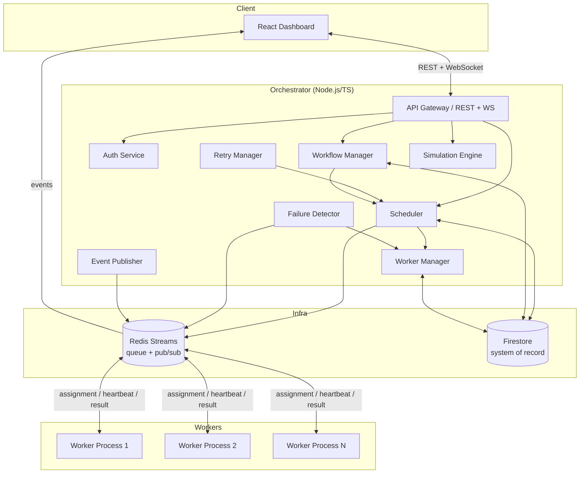

**Chosen components and why:** an API Gateway (REST + WebSocket in one Node process for MVP simplicity, rather than a separate gateway service — a separate gateway is unjustified complexity at this scale), an Auth Service (issues/validates JWTs for both users and workers), a Scheduler (owns the scheduling strategies), a Workflow Manager (owns DAG validation and dependency-gated job release), a Failure Detector (owns heartbeat timeout logic), a Retry Manager (owns backoff/dead-letter policy), a Worker Manager (owns worker registration/state), a Simulation Engine (generates synthetic load in an isolated namespace), and an Event Publisher (fans out state-change events to Redis pub/sub for the dashboard). This list intentionally omits a separate "Job Manager" component from the original brief's suggested list — job CRUD and state-transition logic is folded into the Scheduler/Workflow Manager/Retry Manager, since a standalone Job Manager would just be a pass-through layer duplicating responsibility already owned by those modules.

## 5. Component Responsibilities

| Component | Responsibility | Inputs | Outputs | Dependencies | Failure Mode |
|---|---|---|---|---|---|
| API Gateway | Auth'd REST + WS entrypoint; request validation | HTTP/WS requests | Validated calls to internal modules; responses | Auth Service, all managers | Returns 5xx; does not corrupt state (stateless) |
| Auth Service | Issue/verify JWTs for users and workers | Credentials/tokens | Verified identity + role | Firestore (user records) | Rejects requests; system remains safe (fails closed) |
| Scheduler | Decide which worker runs which queued/eligible job | Queued jobs, worker pool state | Job assignments | Worker Manager, Firestore, Redis | If it stalls, jobs stay `QUEUED` (safe, not lost) |
| Workflow Manager | Validate DAGs, release dependency-satisfied jobs | Workflow definitions, job completion events | State transitions `WAITING_FOR_DEPENDENCIES → QUEUED` | Firestore | Stalled workflow jobs remain waiting (safe, not corrupted) |
| Failure Detector | Detect unresponsive workers | Heartbeat stream | Worker state transitions, job-reclaim triggers | Worker Manager, Redis | False positive → unnecessary reassignment (bounded cost, not data loss) |
| Retry Manager | Apply backoff/dead-letter policy to failed jobs | Job failure events | Re-queue or dead-letter transitions | Scheduler, Firestore | Job stuck in `RETRY_PENDING` at worst (recoverable via reconciliation sweep, Section 16) |
| Worker Manager | Track worker registry and state | Registration, heartbeats | Worker records | Firestore | Stale worker view; corrected on next heartbeat cycle |
| Simulation Engine | Generate synthetic jobs/workers, inject failure events | Simulation config | Synthetic load through the same Scheduler/FD/RM code paths | Scheduler, Failure Detector, Redis | Contained to simulation namespace; cannot affect real data (FR-026) |
| Event Publisher | Fan out state changes for real-time UI | Internal state-change events | Redis pub/sub messages | Redis | UI falls back to next poll/reconnect; no data loss (Firestore remains source of truth) |

## 6. Communication Architecture

- **Client ↔ Orchestrator:** REST for commands (submit job, cancel, configure simulation) and WebSocket for the real-time event stream (job/worker/queue state changes). REST is used because these are discrete request/response actions; WebSocket is used because the dashboard needs server-push, and Server-Sent Events was considered but WebSocket was chosen for its bidirectional channel (future use: live simulation control) at negligible added complexity over SSE in Node.
- **Orchestrator ↔ Worker:** a combination — REST for worker registration (low-frequency, needs a clear request/response with auth) and Redis Streams for job assignment, heartbeats, and results (high-frequency, needs durable at-least-once delivery and natural queue semantics). gRPC was considered and rejected for MVP: it would add a protobuf toolchain and code-gen step for marginal latency benefit at this scale, working against the "fast, easy code" priority for a solo 4-month build; it is noted as a legitimate future optimization (Document 5, Part A).
- **Synchronous vs asynchronous:** job *submission* is synchronous (client gets an immediate job ID). job *execution* is fully asynchronous (client does not block; it observes state via WebSocket or polling). This separation is what allows the orchestrator to accept load bursts without blocking clients on worker availability.

## 7. Job Queue Architecture

- **Structure:** one Redis Stream per scheduling strategy is not used; instead a single logical "eligible jobs" stream is maintained by the Scheduler, which reads from Firestore's `QUEUED`-state jobs (source of truth) and writes assignment messages to a per-worker or shared assignment stream. Redis Streams is used as the *assignment transport*, not as the sole record of queue membership — Firestore remains authoritative for "what is queued," which avoids the classic failure mode of a queue and a database disagreeing about what work exists.
- **Priority/ordering:** ordering within "eligible jobs" is determined by the active scheduling strategy (Document 3, Part B), not by Redis Stream insertion order alone; the Scheduler re-evaluates the queued set each scheduling cycle rather than treating the stream as a strict FIFO pipe.
- **Delivery semantics:** at-least-once (Document 3, Part A) — a consumer group per worker with explicit acknowledgement (`XACK`) ensures an assignment is redelivered if not acknowledged within a timeout, using Redis Streams' consumer-group pending-entries list (PEL).
- **Backpressure / congestion:** if queue depth (count of `QUEUED` jobs) exceeds a configured threshold, the API begins rejecting new low-priority submissions with `503` while continuing to accept high-priority ones, and the dashboard surfaces a "queue congested" state (FR-029 metric-driven).

## 8. Worker Architecture

- **Registration:** worker sends `POST /workers/register` with a worker-scoped credential, declared capabilities (job types it can run), and resource capacity (CPU/memory limits); receives a worker ID and a session token for subsequent Redis stream access.
- **Authentication:** worker credentials are distinct from user credentials (NFR-009); a worker token is scoped only to worker-protocol operations, never to user-facing job-management endpoints.
- **Heartbeats:** sent every `HEARTBEAT_INTERVAL` (default 5s) with current load (active job count, CPU/memory snapshot) — see Document 3, Part G for timeout/suspicion design.
- **Capabilities:** a worker declares the job `type`s it can execute; the Scheduler filters ineligible workers before scoring (Document 3, Part C).
- **Resource reporting:** included in every heartbeat; used by the Resource-Aware strategy and by the dashboard's Workers view.
- **Job execution:** worker pulls its assignment from its dedicated Redis Streams consumer group entry, acknowledges receipt, executes, and reports a result message (`SUCCEEDED`/`FAILED` + payload/error).
- **Result reporting:** result messages are idempotency-keyed by `(jobId, attemptNumber)` so a duplicate/late result from a worker presumed dead is detectable and discarded if the job has already been reassigned (Document 3, Part A).

## 9. Job State Management

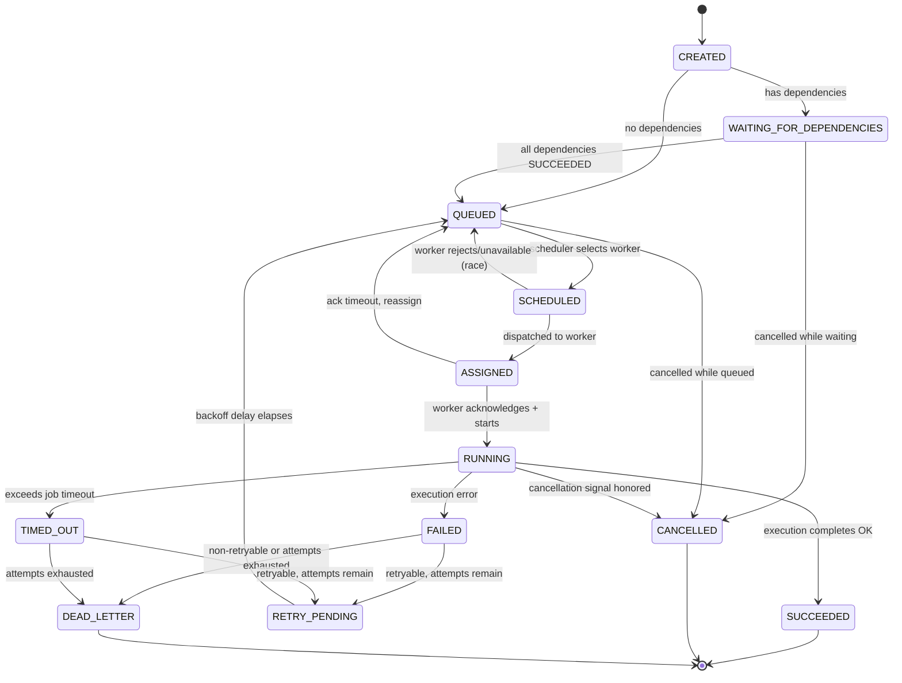

## 10. Worker State Machine

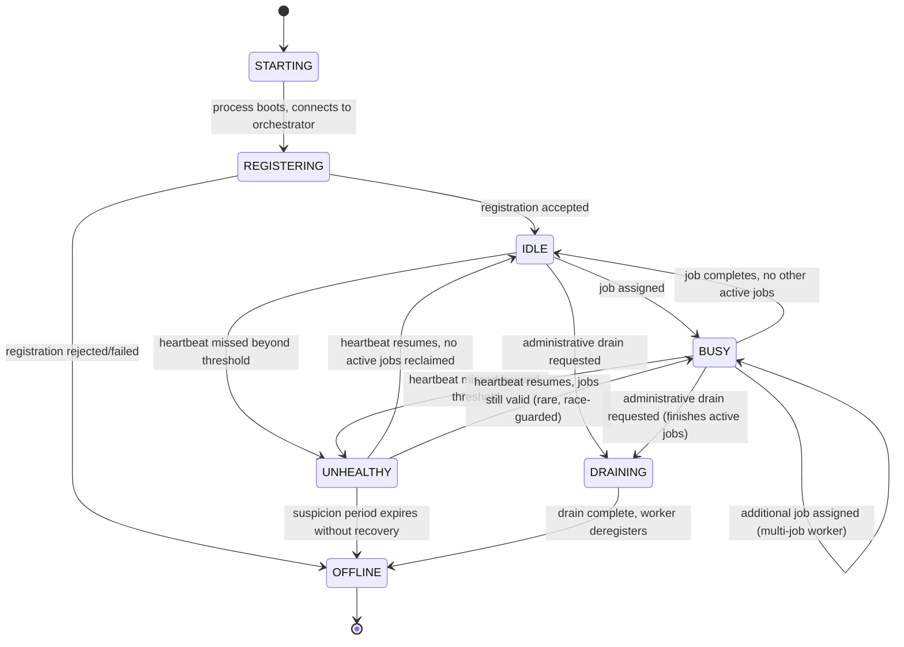

## 11. Database Architecture (Firestore)

Firestore is a document database; there are no SQL joins or multi-table foreign-key constraints. The schema below is designed to work *with* that model rather than simulate a relational schema on top of it, while explicitly compensating for what Firestore doesn't give us for free (Document 1, Section 14).

**Collections**

- `jobs/{jobId}`
  - `type: string`, `payload: map`, `priority: number`, `state: string`, `attempt: number`, `maxAttempts: number`, `timeoutMs: number`, `dependsOn: string[]` (jobIds), `workflowId: string | null`, `assignedWorkerId: string | null`, `createdAt`, `updatedAt`, `result: map | null`, `error: map | null`
  - Subcollection `jobs/{jobId}/events/{eventId}`: append-only log of state transitions (`fromState`, `toState`, `timestamp`, `actor`) — satisfies FR-005 without mutating the parent document, avoiding write contention on a single doc for high-frequency state changes.
- `workflows/{workflowId}`: `state`, `jobIds: string[]`, `edges: {from, to}[]`, `partialFailurePolicy`, `createdAt`, `updatedAt`.
- `workers/{workerId}`: `state`, `capabilities: string[]`, `resourceCapacity: {cpu, memoryMb}`, `currentLoad: {activeJobs, cpu, memoryMb}`, `lastHeartbeatAt`, `registeredAt`.
- `users/{userId}`: `role`, `hashedCredentialRef` (Auth Service reference, not a raw password), `createdAt`.
- `auditLog/{entryId}`: `actor`, `action`, `targetType`, `targetId`, `timestamp`, `metadata`.
- `simulations/{simulationId}`: `config`, `state`, `startedAt`, `completedAt`, `summaryMetrics` — synthetic jobs/workers for a simulation run live under `simulations/{simulationId}/jobs` and `.../workers`, structurally isolated from the top-level `jobs`/`workers` collections (satisfies FR-026 at the schema level, not just by convention).

**Constraints & concurrency compensation:**
- Firestore lacks cross-document foreign-key enforcement, so dependency-graph validity (FR-017) is enforced at write time by the Workflow Manager, not by the database.
- Job state transitions that must be atomic relative to a concurrent competing transition (e.g., two scheduling cycles trying to assign the same job) use Firestore **transactions** (optimistic, read-then-conditional-write) scoped to the single `jobs/{jobId}` document — this is the primary tool used to prevent the double-assignment race described in Document 3, Part I, and it is sufficient because the contended resource (a single job's `state`/`assignedWorkerId` fields) lives on one document.
- Composite indexes are defined on `(state, priority, createdAt)` for the jobs collection (queued-job lookups) and `(state, lastHeartbeatAt)` for workers (failure-detector sweep).
- There is deliberately no cross-collection ACID transaction spanning, e.g., a job and its workflow parent on every single update; instead, workflow-level aggregate state (e.g., "did all jobs in this workflow finish") is recomputed by the Workflow Manager reacting to individual job completion events, which is an eventually-consistent-within-the-same-process pattern, not a distributed one, since it happens inside the single orchestrator instance.

**ER Diagram**

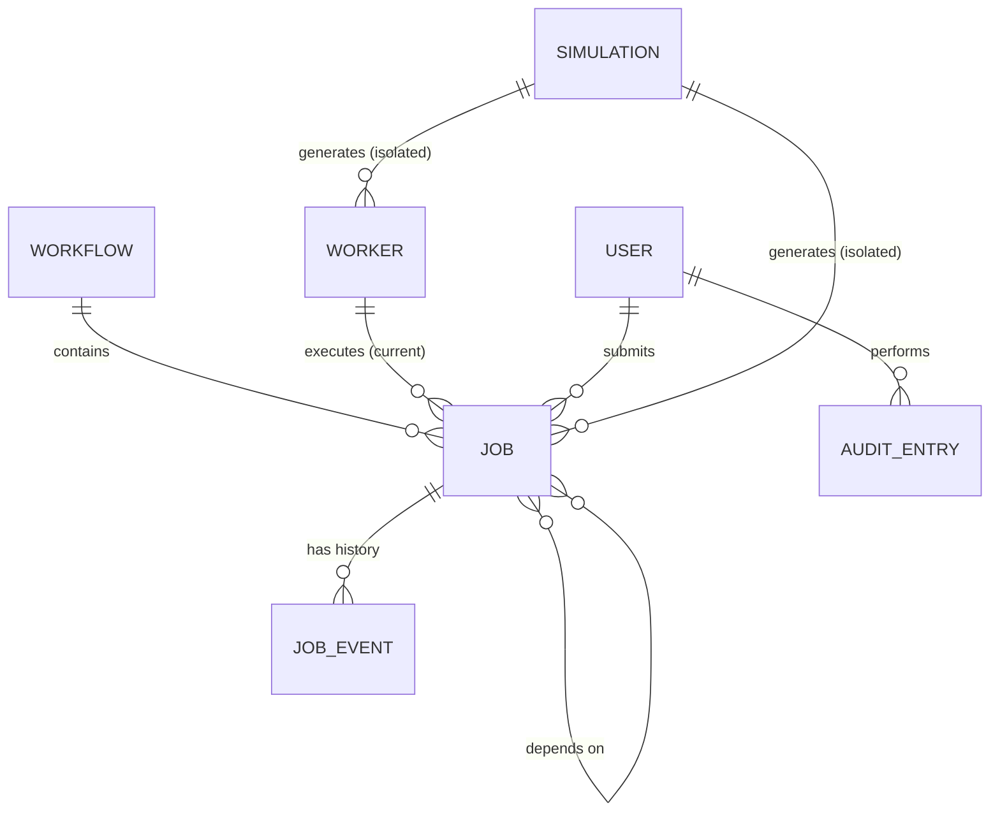

## 12. Deployment Architecture

- **Development / MVP production-like environment:** Docker Compose defines services — `orchestrator` (Node/TS), `worker` (Node/TS, scaled via `docker compose up --scale worker=N`), `redis`, and a `dashboard` (static React build served via a lightweight server or the orchestrator itself). Firestore is a managed external service (Google Cloud), accessed via the Firebase Admin SDK from the orchestrator only — workers never talk to Firestore directly, preserving the loose-coupling principle (Section 3).
- **Configuration:** environment variables control heartbeat interval/timeout, scheduling strategy, retry policy defaults, and Redis/Firestore connection details, loaded per Document 5 Part F.
- **Future Kubernetes migration (not implemented for MVP):** each Docker Compose service maps naturally to a Deployment (orchestrator, dashboard) or a horizontally-scaled Deployment with a HorizontalPodAutoscaler (worker), with Redis potentially replaced by a managed equivalent; this is documented as a viable next step, not built.

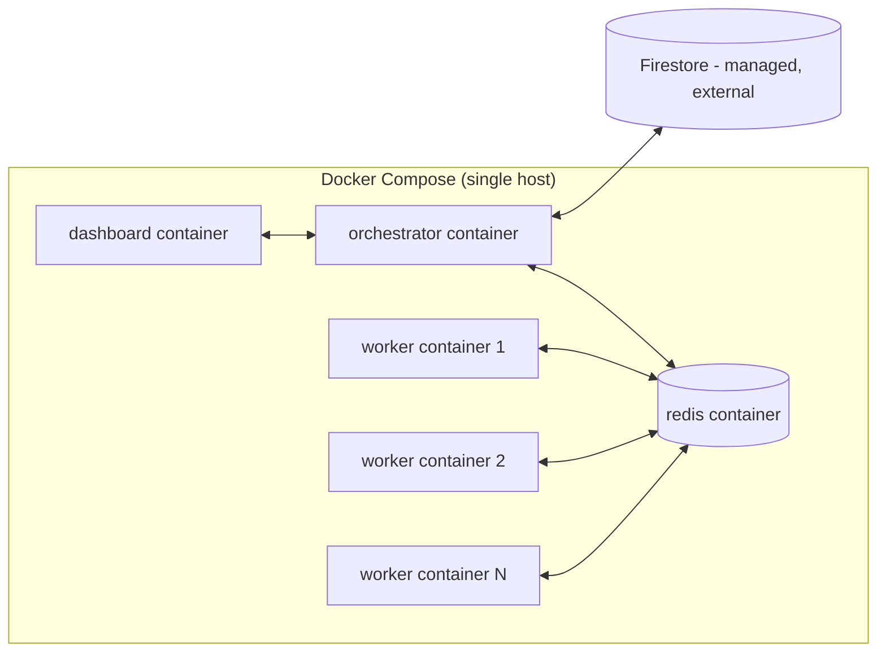

## 13. Data Flow

**Job submission:** Client → API → validate → Firestore write (`CREATED`) → Workflow/dependency check → Firestore write (`QUEUED` or `WAITING_FOR_DEPENDENCIES`) → Event Publisher → Redis pub/sub → Dashboard.

**Scheduling:** Scheduler polls/reacts to `QUEUED` jobs → Worker Manager provides eligible worker set → strategy scores workers → Firestore transaction (`QUEUED→SCHEDULED→ASSIGNED`, set `assignedWorkerId`) → assignment message → Redis Stream (worker's consumer group) → Event Publisher → Dashboard.

**Worker execution:** Worker reads assignment → `XACK` → Firestore write (`RUNNING`) → executes → result message → Redis → Orchestrator validates idempotency key → Firestore write (`SUCCEEDED`/`FAILED`) → Event Publisher → Dashboard; if workflow member, Workflow Manager re-evaluates dependents.

**Failure:** Failure Detector sweep finds stale `lastHeartbeatAt` → worker `UNHEALTHY` → after suspicion window, `OFFLINE` → reclaim: any job with `assignedWorkerId = thisWorker` and state in `{ASSIGNED, RUNNING}` → Firestore transaction back to `QUEUED` → Event Publisher.

**Retry:** Job `FAILED`/`TIMED_OUT` → Retry Manager checks attempt count + error classification → `RETRY_PENDING` with computed backoff → delayed re-queue job (implemented via a scheduled Firestore-backed timer, not an in-memory `setTimeout`, so it survives orchestrator restarts) → `QUEUED`.

**Workflow:** covered by Submission + Execution above; the differentiator is the Workflow Manager's dependent-release step on each job completion.

**Simulation:** Simulation Engine writes synthetic jobs/workers into `simulations/{id}/...` → same Scheduler/Failure Detector code paths operate over that namespace → Simulation Engine can directly command a worker-kill event by force-transitioning simulated worker heartbeats to stop, exercising the *real* failure-detection code, not a mocked version of it.

## 14. UML

**Component Diagram** — see Section 4 (serves as both high-level architecture and component diagram at this scope).

**Use Case Diagram**

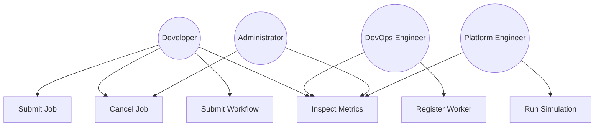

**Sequence Diagram — Job Scheduling**

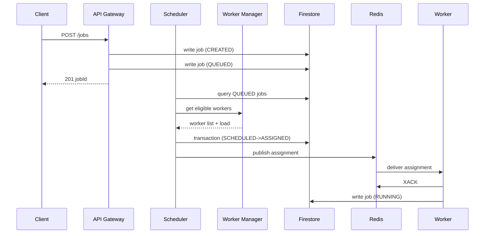

**Sequence Diagram — Worker Failure**

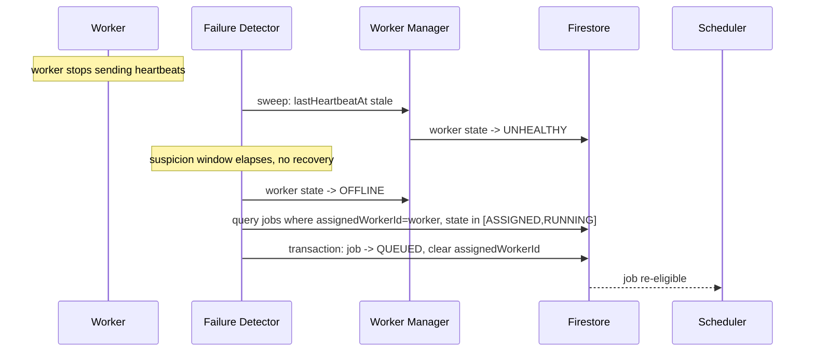

**Sequence Diagram — Retry**

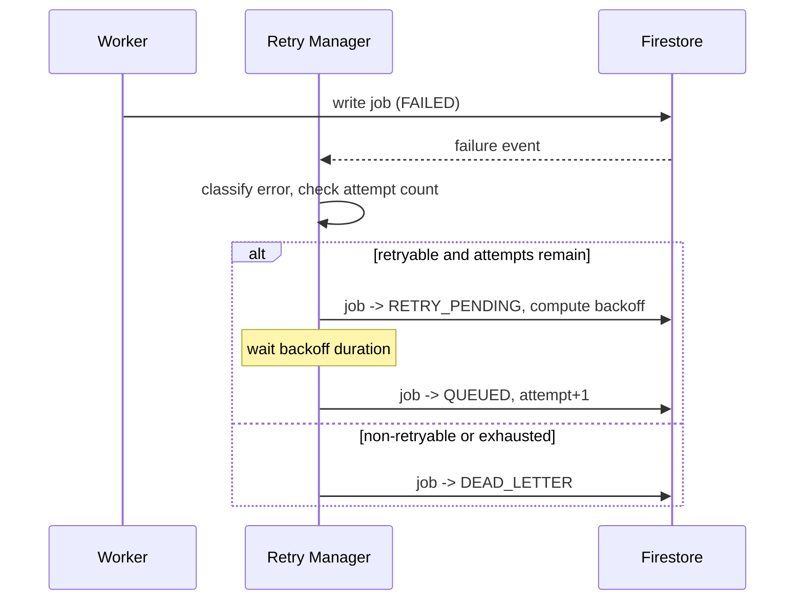

**Activity Diagram — Workflow Execution**

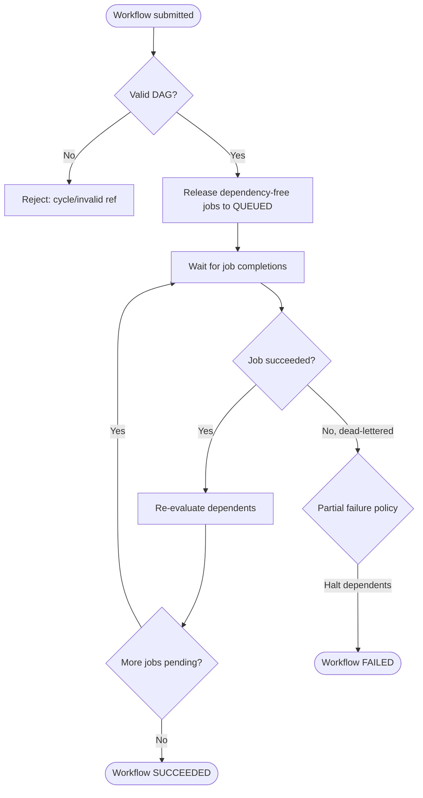

**Class Diagram (core orchestration domain)**

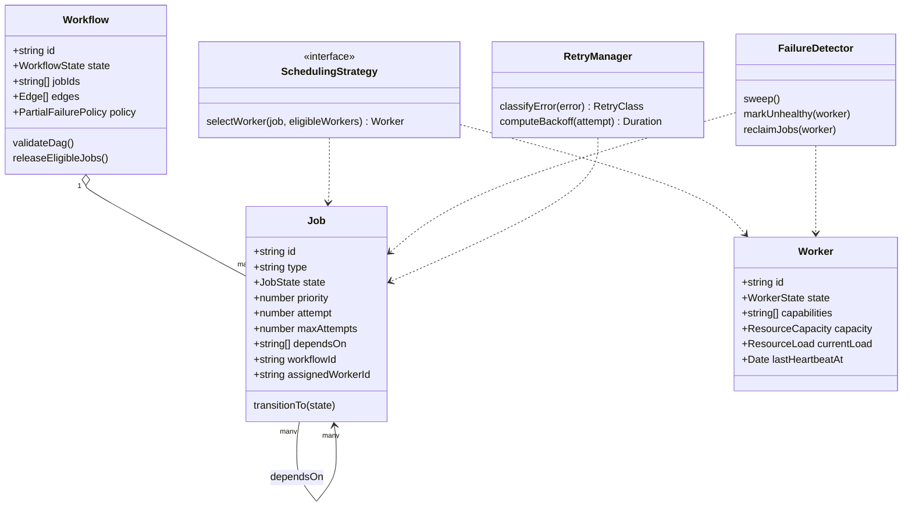

**Deployment Diagram** — see Section 12 diagram.

## 15. Architecture Trade-offs

**Single orchestrator instance vs. multi-instance with leader election**
- Alternatives: run 1 orchestrator; or run N with distributed leader election (e.g., via Redis lock).
- Advantages of single: no leader-election complexity, no split-brain risk, straightforward to reason about and test within 4 months.
- Disadvantages: orchestrator is a single point of failure; cannot horizontally scale scheduling throughput.
- **Decision:** single instance for MVP.
- **Consequence:** documented explicitly as a Non-Goal (Document 1, Section 5); acceptable because target load (Document 1 NFR-001/004) does not require multi-instance scheduling throughput, and worker execution — the part that must scale — already does via the worker pool.

**Firestore vs. PostgreSQL**
- Alternatives: Firestore (chosen per project constraints); PostgreSQL (the brief's default recommendation).
- Advantages of Firestore: managed, free tier suitable for a student project, real-time listeners align well with the dashboard's push requirements, no server to operate.
- Disadvantages: no multi-document ACID transactions across arbitrary documents, no relational joins for dependency queries, requires denormalization and application-level integrity enforcement (Section 11).
- **Decision:** Firestore, with document-scoped transactions used for every state transition that must be race-safe, and dependency-graph integrity enforced in the Workflow Manager rather than the database layer.
- **Consequence:** slightly more application code to enforce what a relational database would enforce natively; explicitly called out as a technical risk in Document 1, Section 15, and mitigated via concurrency tests (Document 4, Part F).

**Redis Streams vs. Kafka/RabbitMQ**
- Advantages of Redis Streams: single lightweight free container, doubles as cache/pub-sub, consumer-group semantics give at-least-once delivery without operating a separate broker class of infrastructure.
- Disadvantages: less mature ecosystem for very large-scale partitioned consumption than Kafka; persistence guarantees are weaker than Kafka's log-based durability unless Redis persistence (AOF) is explicitly configured.
- **Decision:** Redis Streams, with AOF persistence enabled in the Compose config so stream data survives a Redis container restart.
- **Consequence:** acceptable for the project's scale target; documented as a swap-in point if the project were extended toward production scale.

**REST+Redis vs. gRPC for orchestrator↔worker protocol**
- Already covered in Section 6; trade-off restated here for completeness: chosen for development speed over marginal performance gain, appropriate given the "fast, easy code" priority and solo timeline.

## 16. Architecture Failure Scenarios

- **Worker fails:** detected via heartbeat timeout (Section 10); in-flight jobs reclaimed and re-queued (Section 13, "Failure" flow). No data loss; bounded delay equal to heartbeat timeout + suspicion window.
- **Scheduler fails (i.e., orchestrator process crashes):** in-flight assignments already written to Firestore/Redis are not lost; on orchestrator restart, a **reconciliation sweep** runs at startup that re-derives in-memory scheduling state from Firestore's persisted job/worker states (this sweep is the mechanism referenced in Section 5's Retry Manager failure mode) — no job silently disappears because Firestore, not orchestrator memory, is authoritative.
- **Database (Firestore) fails/unreachable:** API returns 503 for write operations; already-scheduled jobs continue executing (workers hold their assignment in memory until they can report the result, retrying the result write with backoff); the system pauses new scheduling rather than corrupting state.
- **Broker (Redis) fails:** new job assignments cannot be dispatched; already-`RUNNING` jobs on workers continue and workers buffer results to retry publishing once Redis recovers; Firestore remains consistent as source of truth. Dashboard real-time updates pause; dashboard falls back to a REST poll on reconnect.
- **Network fails (partition between orchestrator and a worker):** indistinguishable at the protocol level from a dead worker; handled identically via heartbeat timeout — this is a deliberate simplification consistent with the FLP/CAP-theorem reality that a distributed system cannot reliably distinguish "slow" from "dead" (elaborated in Document 3, Part A).
- **Multiple workers fail simultaneously:** Failure Detector processes each independently; reclaimed jobs re-enter the queue and are redistributed among surviving workers by the Scheduler on its next cycle — this is exactly the scenario Simulation Mode's "kill N% of workers" demonstrates (Document 1, UC-12).

---
*End of Document 2. Proceed to Document 3 (Distributed Engine, Scheduling & Algorithms Design) on approval.*
